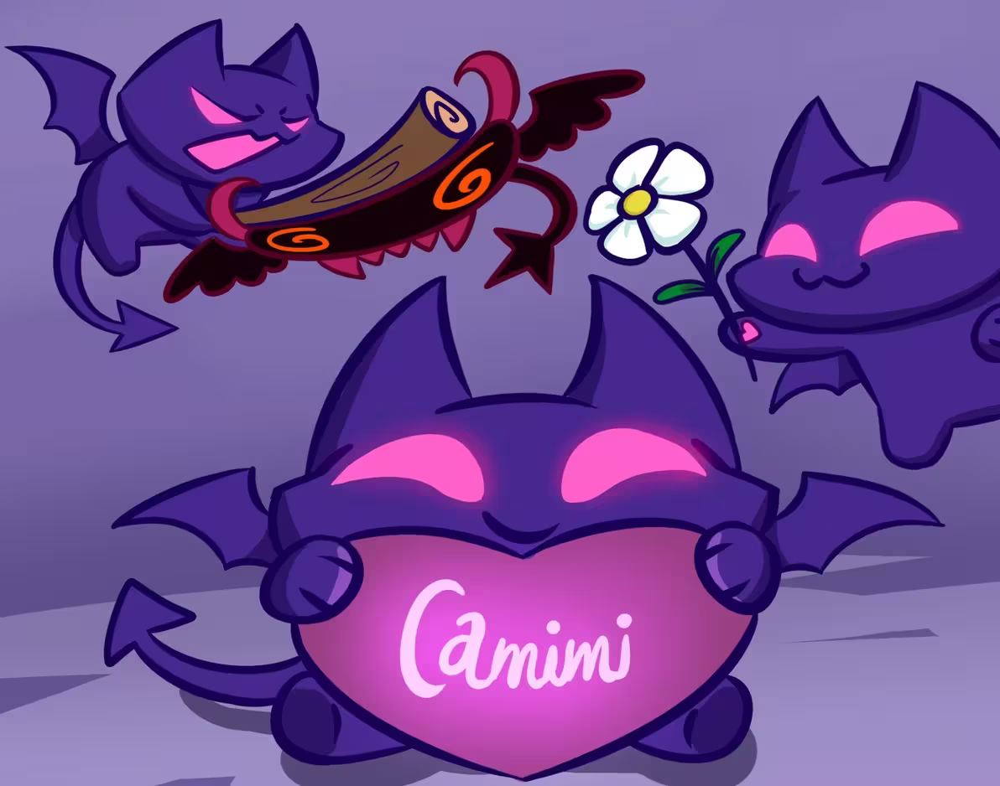
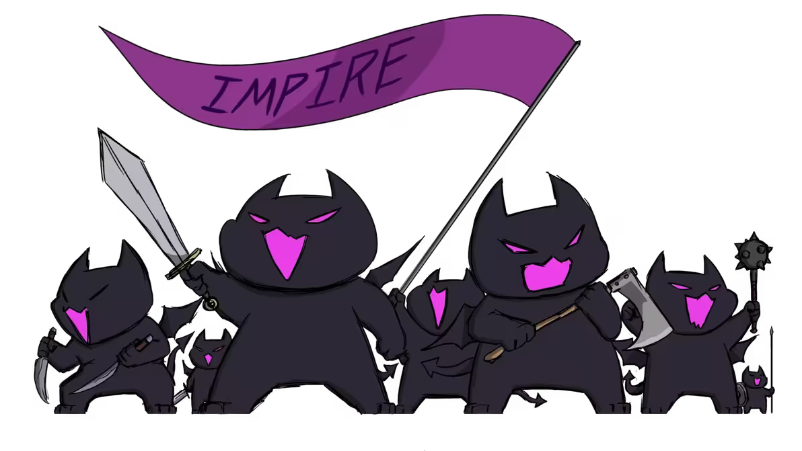
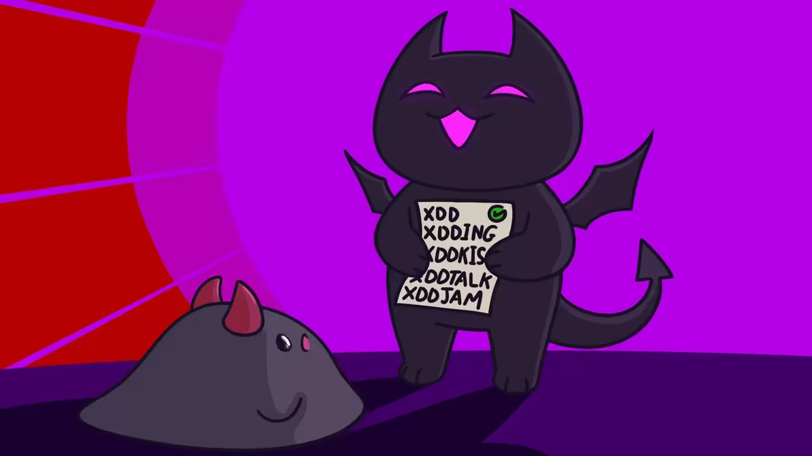
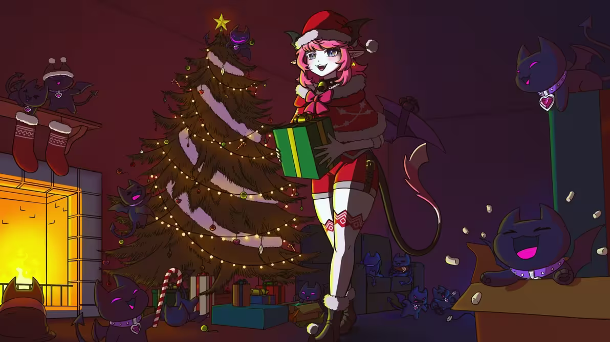
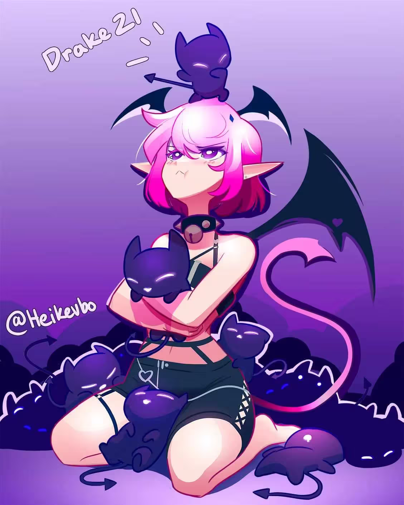
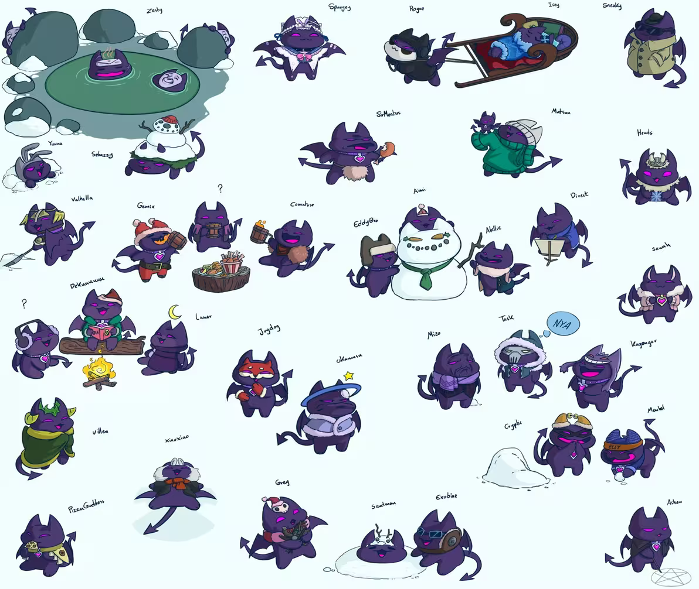
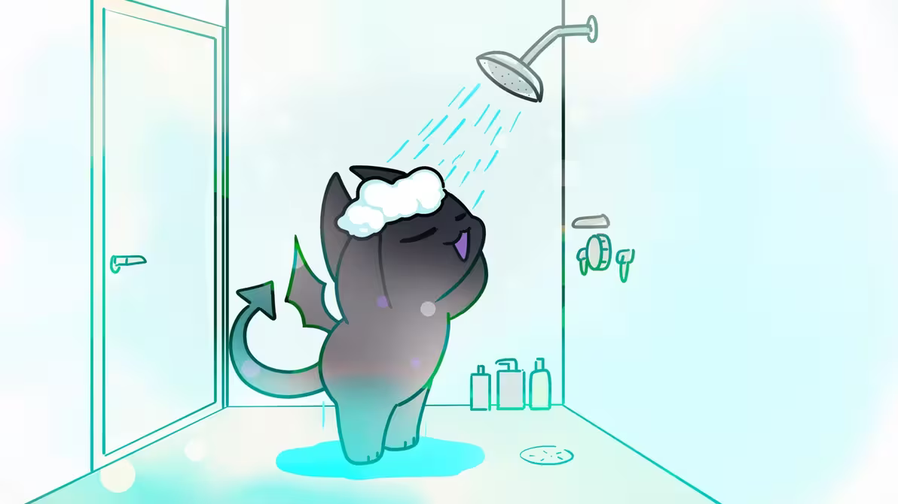
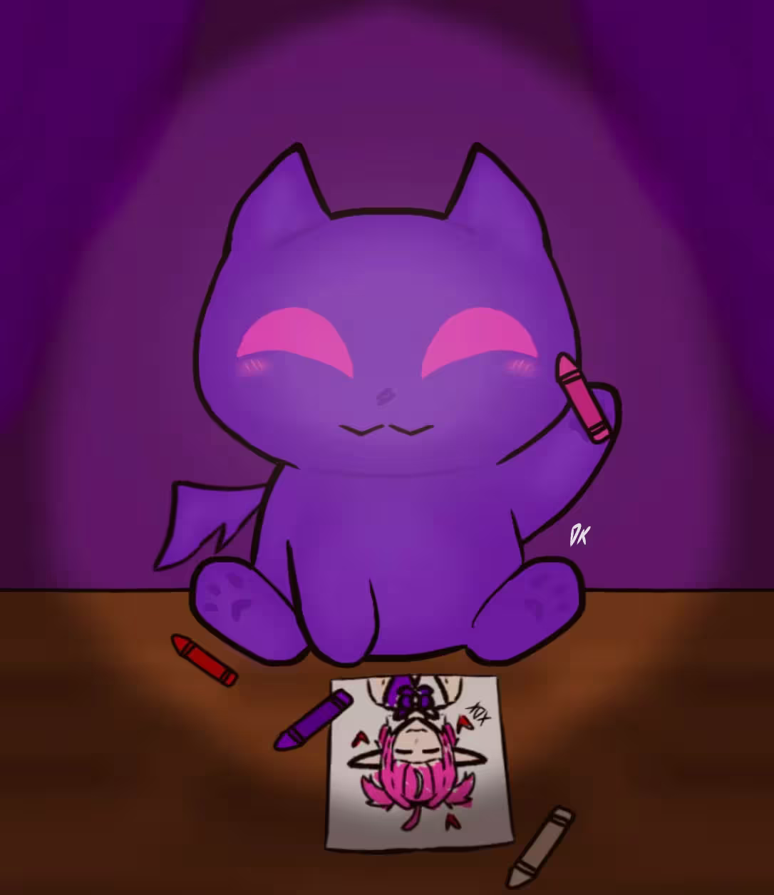
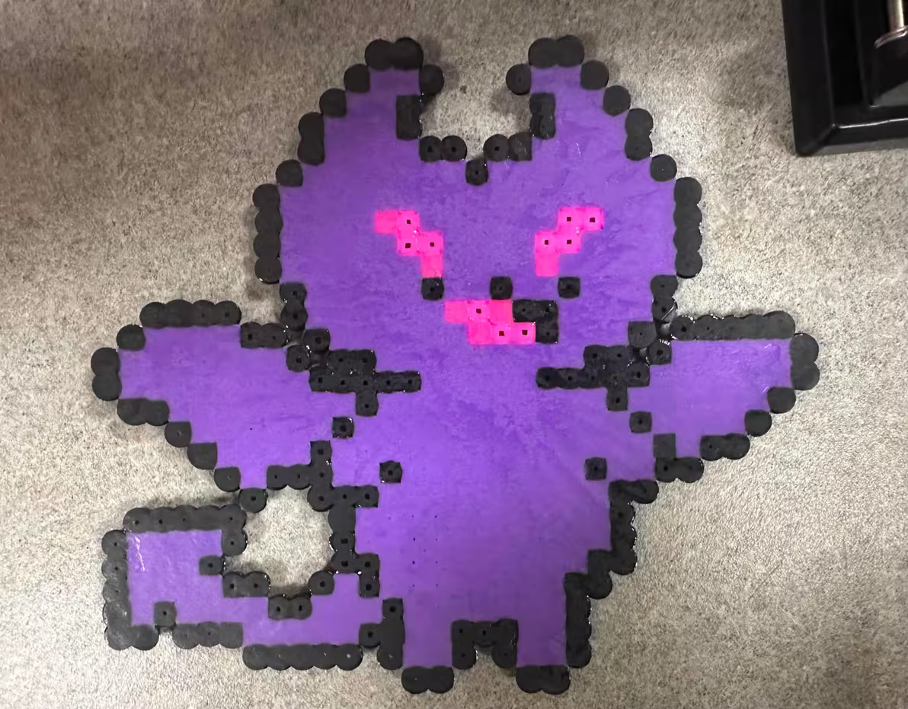
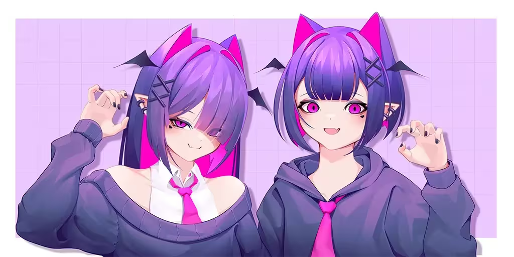

## 何为Cimp？

​	好吧，就是我们啦。吾也，汝也。众目所及，举世同名。 顺便说一句，这**不是**`Simp`，而是`Cimp`。用**k**发音，听起来像`kimp`

:::tip
 **Cimp**的简中译名：**皮皮**  
 **Impire**的简中译名：**皮奇堡**
:::

## 历史

### 原型Camila时期

​	Camila各时期的时间线：[Camila是谁呀-六七Camila史](/guides/whoiscamila/#六七camila史)

​	在`Cimp` 发展为今日广为人知的紫色猫型小恶魔形象之前，曾存在一个被后人称为 `Proto-Cimp` 的早期阶段。一只神秘的黑猫，拥有闪烁着粉紫光芒的眼睛，在昏暗环境中尤为醒目。（超级可爱，对吧）由于其眼部特征极具穿透感，部分观众曾以`蝙蝠猫（bat cat）`称呼这一形象。

​	这一时期，Camila 与其社群成员共同参与了对该形象名称的讨论与筛选，试图为这一新生角色确立合适的称谓。被广泛提出的候选名称包括 **Binx、Ink 与 Onyx**，均与其阴影般的猫科外观相契合。

​	其中，“Binx”一名由早期社群成员 Zevdy 提出，并迅速获得认可，成为最具代表性的命名方案。

> “你觉得用Binx会惹麻烦吗？毕竟《女巫也疯狂》里那只黑猫也叫这个名字。”  
>
> ——Camila

​	最初，“Binx”这一名称及其概念，即“拥有发光粉色眼睛的黑猫形象”，被用于 **Impire** 的首个服务器机器人。此后，该形象逐步从功能性角色转化为具有情感与陪伴意义的存在，并最终确立为**第一位 Cimp** 的身份。（详见下文）从机器人到伙伴，可谓华丽蜕变。

​	但有趣的是，“**Cimp**”这一称谓并非一开始便存在，而是在此之后逐渐形成。

​	该名称源自社群的语言创造，将 **Cat** 与 **Imp** 两个概念相结合，准确捕捉了这一角色兼具猫科特征与小恶魔属性的双重本质。*(we’re just ~~built different~~ BILL DIPPERLY ）*

​	Aww！关于第一位 Cimp 的更完整形象与叙事，你可以在这里看到 [Camila是谁呀-传记-第一只皮皮](/guides/whoiscamila/#第一只皮皮)

### 书写Cimp的历史

这还有什么可说的？我们的历史怎么能缺了你呢，笨笨。 今天就来一起书写Cimp传奇吧！

import LinkCardPlus from '../../../components/LinkCardPlus.astro';

<LinkCardPlus 
  title="QQ群组"
  label="QQ群组"
  image="/QQ.png"
  href="https://qm.qq.com/q/S9K2JSAycK"
  description="一个cimps们的小窝，在这孤立无援的寒冷世界中相互取暖，相信我们总有一天可以进入到那最大最热闹的马戏团"
/>
<LinkCardPlus 
  title="Discord群组"
  label="Discord群组"
  image="/Discord.svg"
  href="https://discord.gg/camila"
  description="加入这场派对，成为一名Cimp吧！"
/>

## **Cimp画作**

各种散落在皮奇堡各地的Cimp艺术作品合集。

早期的Cimps，整装待发 

Cimps正在带坏Noomba（Numi的粉丝们），把Cimp语刻进了他们的DNA里，为xdx的发扬光大做出了不可磨灭的贡献 由[AshenGlister](https://wiki.impire.xyzbooks/ashenglister)绘制 

Cimps和Imp第一个一起度过的圣诞节 由[AshenGlister](https://wiki.impire.xyzbooks/ashenglister)绘制 

Cimps和Imp玩的超开心<i><s>（指蹬鼻子上脸）</s></i> 

一群Cimps在雪中玩耍的场景。包含了所有的著名老资历Cimps 由[AshenGlister](https://wiki.impire.xyzbooks/ashenglister)绘制 

Cimp在洗澡（不要偷看！） 由[AshenGlister](https://wiki.impire.xyzbooks/ashenglister)绘制 

Cimp正在画蜡笔米拉 由Dkdra绘制

Cimp的拼豆 由Nonbidairy制作

不知名魔法把Cimps变成了...美少女？！ 由Mats_kuro绘制

## **杂谈**

1. **身体特征：**
   - 毛茸茸，圆滚滚的拟人化猫妖，眼眸泛着虹彩光泽，通常拥有极短的四肢，大脑袋上顶着猫科动物般的犄角，以及尾巴末端呈尖锐三角形的尾尖。
2. **栖息地：**
   - 偏好光照有限的场所。
3. **行为特征：**
   - Cimps的行为模式主要表现为：在直播突袭等特殊场合搞恶作剧，当火车王，刷屏骚扰及xdx行为，此类举动不胜枚举。
4. **饮食习性：**
   - 偏爱异域美食，虽以鱼类为主食，却钟情于名为“巧克力寿司”的恶名料理。*（查了下看起来挺好吃的）*
5. **特殊能力：**
   - Cimps具备复活能力，但无法主动施展，需满足特定条件方能复活。
6. **文化意义：**
   - Cimps因其可爱又傻气的特质备受敬重，虽爱捣蛋，却非常乐于分享自身擅长的领域中的幸运与智慧。
7. **进化历程：**
   - 环境因素是其体色由黑色演变为深紫色的主因，亦解释了部分个体具备飞行能力的原因。
8. **与人类及其他生物的互动：**
   - 除皮奇堡内部关系外，Cimp主要与小恶魔女王互动。当被**照顾**时，它们会对特定对象异常黏人，不断索要**抱抱**。
     - **词源：** `Cimp`一词巧妙融合了**猫+恶魔**的双重意象。有趣的是，在社群创造“Cimp”一词前，Proto-Cimp（一只拥有粉紫色发光眼眸的黑猫，亦称“蝙蝠猫”）曾被考虑命名为Binx、Ink或Onyx。其发音为`Kimp`而非`Simp`。
9. **性格特征：** Cimps的爱好与性格各异，但因其基因中刻印着发送xdx的本能，以及有着完成名为`《Cimpography》`（皮克谱）杰作的宿命。

---
 
 
 
 

## 贡献者

  
  翻译/校对:  [\_Veronique\_](https://space.bilibili.com/24850713) 
   

  
  编辑:  [上村结川-Slanter](https://space.bilibili.com/15197245) 
   

  
  原Wiki页面： https://impire.live/about/cimp
   

  
  网页开发/MD编辑:  [ClassIsBand](https://xn--fjqu59cvx0aoqi.icu/about/) 
   

**转载及翻译已均获授权，未经许可不得二次转载**