## 谁是Camila

​	Camila 全名：“Camila the Imp”_（中译: 小恶魔卡米拉  日译: カミラ・インプ ）_

​	Camila是一位以混沌风格著称的小丑主题 VTuber。她于 `2022 年 7 月 10 日`正式出道，自此活跃于 `Twitch` 平台，以顽皮的小恶魔气质与夸张滑稽的表演风格，给大家带来欢乐与混乱的直播体验,目前隶属于 **Mythic Talent** 公会。

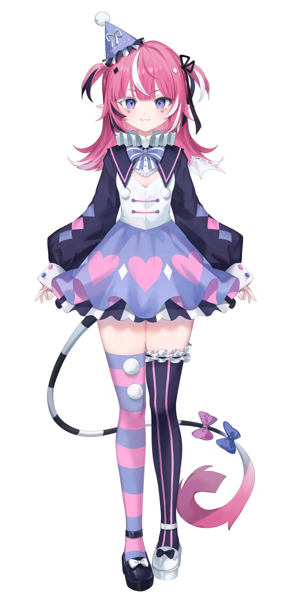

Camila 目前使用的Ver.3.0模型 

## 性格

​	Camila *( imp, mimi , camimi )* 最广为人知的形象是一个**傻乎乎，爱恶作剧却心地善良的小恶魔兼小丑形象女孩**。（ *其中 “小丑” 特质尤为突出*）

​	直播内容以聊天与社区互动为核心，她最热衷于与自己的社群“皮皮”*（Cimp）*聊天互动，偶尔掺杂些许“游戏互动”元素。*（此处“游戏”及“互动”一词使用极为宽松）*

​	尽管常搞恶作剧且玩笑，但真正让Camila感到快乐的时刻，莫过于与社群伙伴们共度时光，并在每一场直播中传递其独特而兼具混乱与温馨的独特氛围。

## 外貌

​	Camila 的外观设计极具辨识度，尤其是相较于其他的模型，Ver.3.0中增加的设计锚点最多：

- **发型：** 粉色长发，夹杂一缕白色挑染，双马尾造型，佩戴一顶 略显歪斜的派对锥形帽，象征其随时准备庆祝派对的形象设定
- **眼睛：** 紫色渐变瞳孔，带有闪光效果 *（字面意思上的闪闪发光呢）*
- **服装：** 目前Camila的主要服装风格为一套风格鲜明的，融合了现代小丑美学 `jester` 与粉彩哥特式洛丽塔风格 `pastel-goth Lolita` 的服装
- **小恶魔特征：**
  - 小恶魔耳朵 *（其实就是精灵耳）*
  - 一条黑白条纹的细长恶魔尾巴，上面装饰着蝴蝶结 *（末端是长长的毛发）*
  - 仅在身体左后侧有的一只布料 + 丝带结合样式的小恶魔翅膀

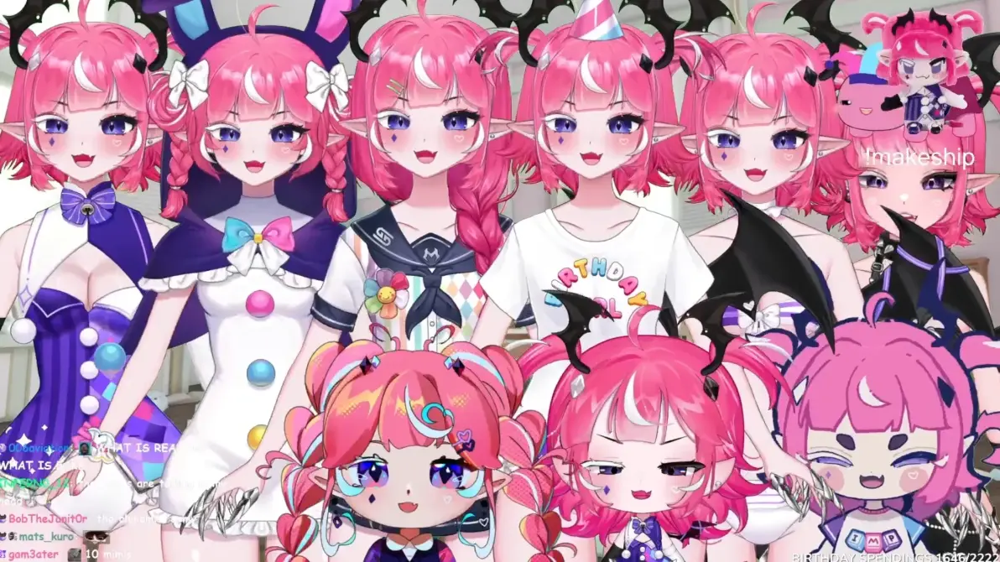

在这里你可以看到Camila从3.0时代之前的全部模型和服装<i>（光是渲染这一帧，她的电脑都快炸了）</i> 

## **皮奇堡**

​	Camila的狂热粉丝群体被称为“皮皮”（Cimp）。

​	官方Discord服务器，名为“皮奇堡”（The impire）

import LinkCardPlus from '../../../components/LinkCardPlus.astro';

<LinkCardPlus 
  title="QQ群组"
  label="QQ群组"
  image="/QQ.png"
  href="https://qm.qq.com/q/S9K2JSAycK"
  description="一个cimps们的小窝，在这孤立无援的寒冷世界中相互取暖，相信我们总有一天可以进入到那最大最热闹的马戏团"
/>
<LinkCardPlus 
  title="Discord群组"
  label="Discord群组"
  image="/Discord.svg"
  href="https://discord.gg/camila"
  description="加入这场派对，成为一名Cimp吧！"
/>

## 六七Camila史

### 人物概述

​	Camila是一位个人向小恶魔虚拟主播，主要在[Twitch](https://www.twitch.tv/Camila)进行直播 *（别称 T台/老鼠台）* 。她是一只小恶魔（**而非魅魔**），热衷于捉弄和恶作剧任何人。mimi的直播生涯已逾**四年** 。

> 聊天愉快时光，如光阴似箭。

​	她的直播以聊天为主，偶尔穿插一些“游戏”环节 *（所谓穿插，就是她可能打开个游戏...吧）*。你在此处的唯一缘由，正是她，而这个wiki的诞生，亦因她而起 *（不客气噢~）*

:::tip[小故事]
	此处关于是否是魅魔的问题在社区中争议较大，遂附上原文：“She is an Imp (not a succubus) ”，经查证和考究后得出结论为不是魅魔。

​	按照背景故事，Camila出生于魅魔之境，但这不代表她就一定有魅魔血统，且她并不丰满（除了相对丰满的2.0版本）。同时也一直以逗乐和嬉闹为兴趣爱好，对魅魔普遍的进食行为并没有强烈需求或喜好。此结论是按照魅魔的一般行为和特质得出的，并不代表没有以上属性就不可以做魅魔。只是在没有直接证据的情况下，在魅魔之境出生≠魅魔。

​	在英语中，“Imp”这个词更多的情况指代的是淘气鬼/小顽皮，同时在魔幻题材作品中，该词会被指代为劣魔或低等恶魔。鉴于Camila的背景故事和人设结合了二者，所以Imp最好的翻译方式应为“捣蛋小恶魔”。但这样太长，所以依旧以小恶魔为简称来称呼。
:::

### **原型Camila时期（出道前）**

​	在成为我们熟知并热爱的混沌系小丑之前，小恶魔Camila经历了“原型Camila”时期————在这个探索阶段里，未来的恶魔女王仍在寻找自我身份。*（每个人都有起点）*

​	最离谱的是,在成为Camila之前，她曾用过截然不同的名字——`Cherry Quartz`（樱桃宝石），最终更名为“Camila”。这标志着这是她蜕变为恶魔女王*（笨蛋mimi）*的关键转折点。

在这段探索期，Camila经历了多次模型迭代：

- VRChat模型（初代原型Camila）：这是启发角色设计的最初版本 *（遗憾的是仅存一张传奇照片。）*

- Marin模型： 这款绑定模型深受《更衣人偶坠入爱河》中**喜多川海梦**的启发。[她的绑定模型师](https://x.com/kvxart) 专门为她打造，帮助她在出道前适应他的绑定系统。（好奇的话...没错，就是*那个模型*，懂的人自然懂）
- PNG模型：基于**Blinchii**艺术设计的PNGtuber造型，用于出道前的直播时期。
- 暗影小恶魔时期：部分皮皮仍记得这个神秘阶段，它预示着即将降临的顽皮恶魔能量...

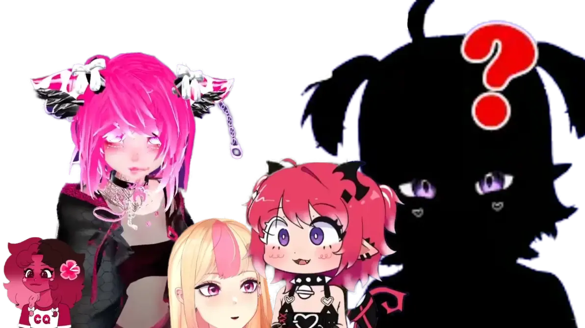

处于探索期的Camimi各版本，介绍顺序为从左至右，为后来在Ver1.0演变为很有弹性的小恶魔奠定了基础 <i>（也就是活蹦乱跳的长颈鹿脖子）</i> 

### Camila 1.0时代

​	Camila于生日当天`2022年7月10日`正式亮相，展现出她活泼开朗*（受气包）*的个性以及**无穷无尽**的娱乐天赋，为皮皮们带来欢乐。

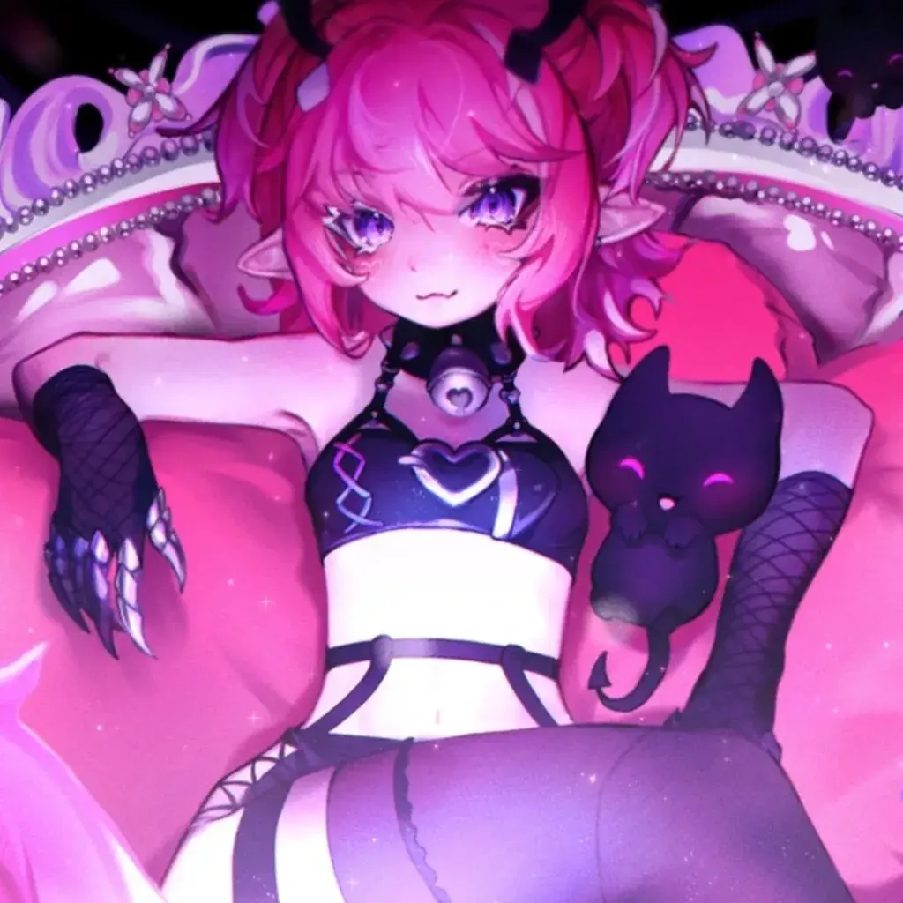

Camila Ver1.0 与皮皮们共度闲暇时光 

​	在此阶段，她与新老朋友展开联动，无论知名与否，她的影响力已渗透至各大主播圈层，出道数月便在虚拟主播界留下深刻印记 *（至今仍持续发力中）* 。

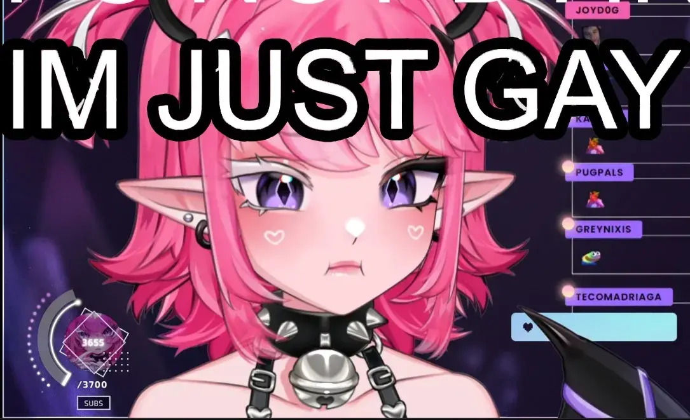

默剧米拉（Mutemila）尽展本色，比婊子还high 

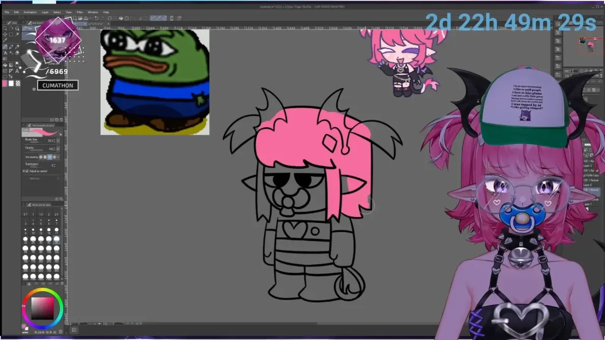

此处见证了宝宝米拉/尿尿米拉（Babymila/pissmila）的早期起源与经典meme 

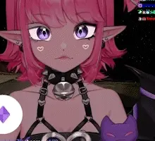

活蹦乱跳的长颈米拉（Giraffe neck imp） 

### Camila 2.0时代

​	经过一个月的休整，小恶魔宣布以**Camila Ver2.0**重新出道。

​	与首次出道时相同，小恶魔在生日当天（`2023年7月10日`）正式亮相Camila Ver2.0。

​	此次出道中，小恶魔揭晓了角色设计的诸多变革：Camila已蜕变为小丑滑稽风格的VTuber，彻底改变了直播美学风格，却依然保留了小恶魔一贯的欢快特质。本次重启发布了全新表情包、背景、服装，以及动画版《Rollin' Girl》音乐视频。 

​	在同年晚些时候，3D模型与比基尼造型相继发布。

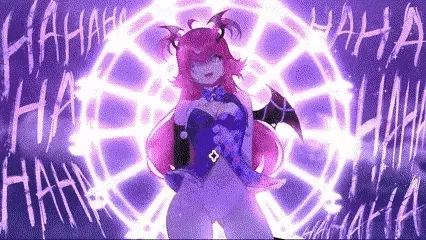

“法官大人！我的眼前简直一览无余！”当小恶魔展示全新等待界面时，皮皮们如此激动地喊道 

​	Camila也鼓起勇气向其他主播联动，由此在2023下半年直播中缔造了诸多**传奇**时刻：

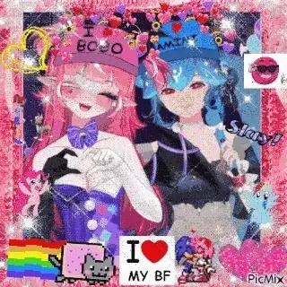

Bobo与Camimi互相示好 

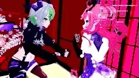

Froot因Camila迟迟未与她联动而惩罚她...天啊Camimi这记性… 

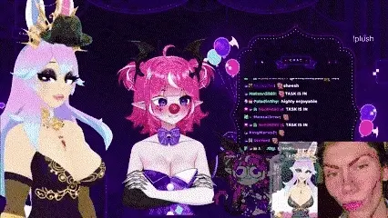

Rizz Rizzington让Cotton和Camila展示她们聊天时的情谊 

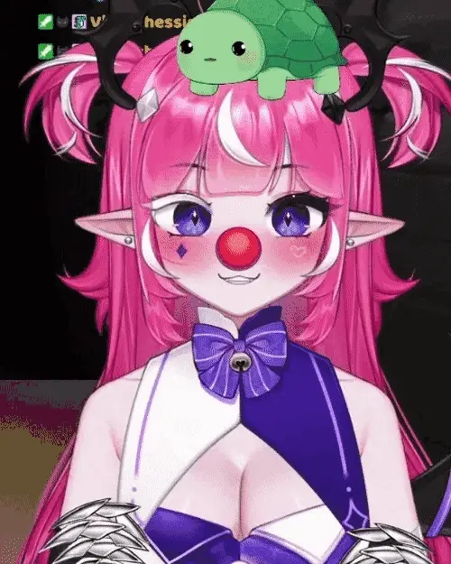

“哔！哔——哔——哔——！”醉醺米拉（Drunkmila）试图破译British Femboy Vedal的摩斯密码时惊呼 

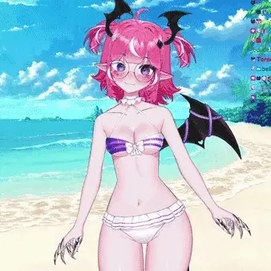

呃...呃...呃...比基尼米拉（Bikinimila）穿着泳装炫耀她的眼镜 

### 女皇

​	女皇（The Impress）是Camila的终极形态。她是所有皮皮倾倒的对象。

​	女王的诞生源于另一位主播**Elly**的背叛——Elly在向女王表白后，竟与另一名主播出轨（脚踏两条船的Elly）。此事令Camila心碎欲绝，致使女王身上所有美好特质皆扭曲为邪恶与扭曲——这正是女皇的本质，由此诞生了混沌与邪恶的化身。

**	“女王”**（The Imperess）（后演变为**“女皇**”）之名首次出现于传奇的2022年订阅马拉松。其起源可追溯至皮皮xantimatterx_的留言。

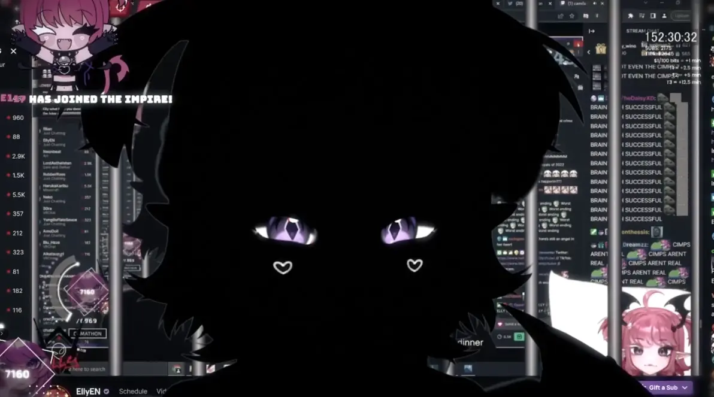

女皇 Ver1.0 | 女皇初降之仪，此乃其真身首次现于世间 | 

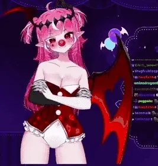

女皇 Ver2.0 | 威临再世，尊号无上；凡见其形者，当肃立；凡闻其名者，当俯首 | 

**女皇万岁，万岁，万万岁！**

### 我的小丑学院

​	2023年12月初，Camila的2.0订阅马拉松活动正式启动。小恶魔开设了自己的`我的小丑学院`频道，在此自学成为认证小丑。*（尽管她早已是了）*

​	活动期间她不仅展示了全新校服造型，更在为期一个半月的直播中持续带来海量内容与惊喜。

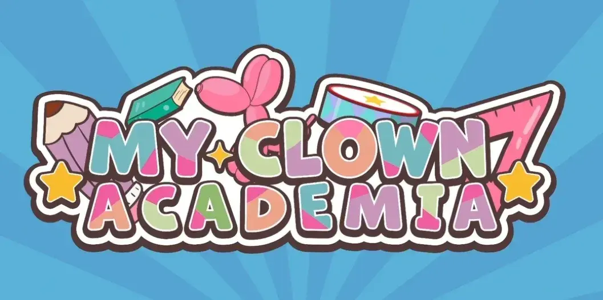

《我的小丑学院》官方标识  

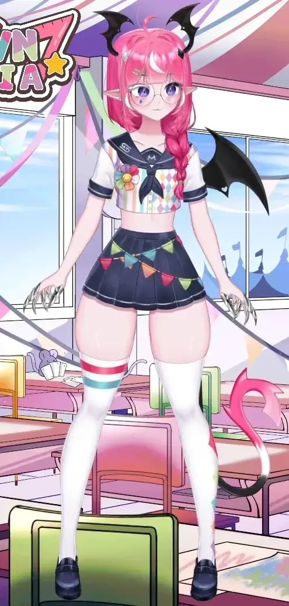

Camila新造型揭晓 限时版学院米拉（Schoolmila） 

### 2024春季新装亮相

​	在此期间，Camila暂时放下了为小丑学院考试投入的无数学习时光（她以优异成绩毕业哦）。

​	紧接着，她宣布了全新亮相，带来新表情动作与新装扮。此时她的复活节新装正式亮相。

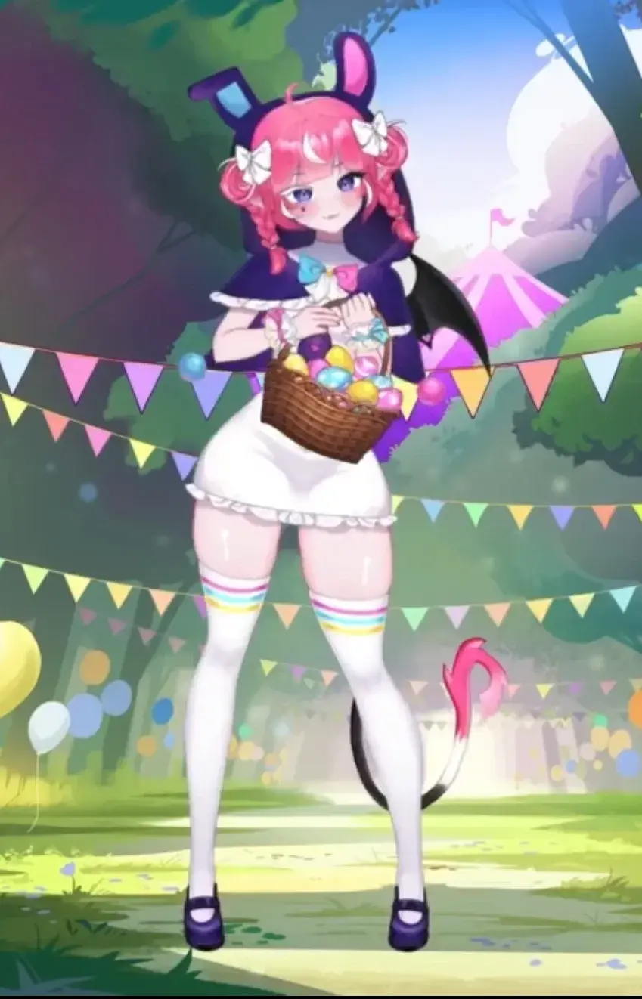

彩蛋兔Camila向Chat展示她的彩蛋篮 

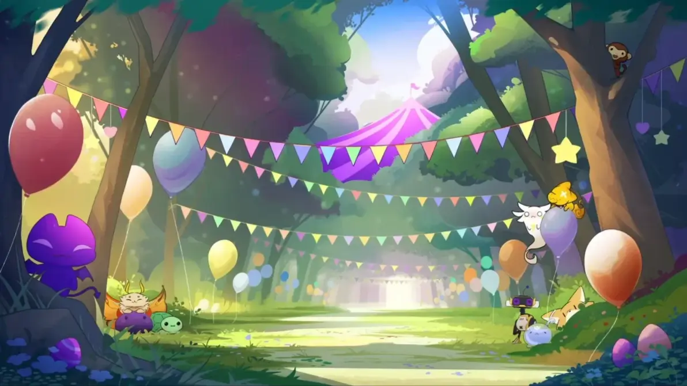

春季复活节背景动画由[Hei🌙Kevbo](https://x.com/heikevbo/status/1779252724519092488)创作 

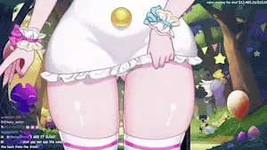

彩蛋兔Camila展示她的...特殊功能 

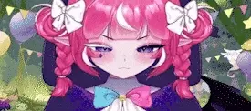

彩蛋兔Camila释放内心恶魔 

​	本次直播创下非凡里程碑：为**Dadmila**（也就是Camila的父亲）筹集**17696.96**美元偿还债务，使他免于长期从事糟糕工作，成为直播史上为公益事业募集的最高金额。

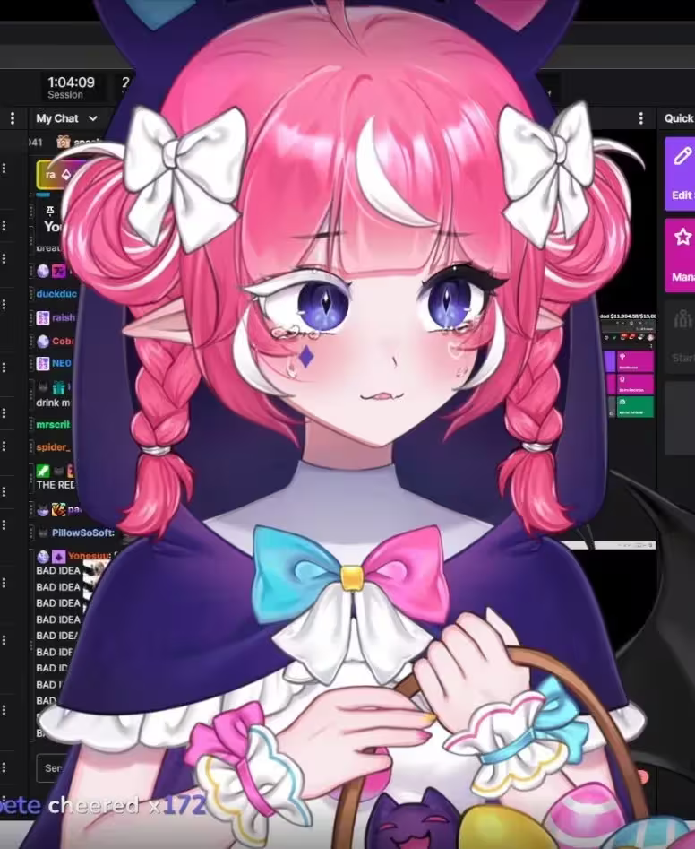

彩蛋兔Camila被观众与朋友们的支持与感激所感动，我们深爱着你们  

### Camila 3.0时代

​	速通小丑学院并第三次回归现实后，小恶魔回到了舞台，携**Camila3.0**重磅登场：新帽新装，更锋利的尖牙，调皮捣蛋的本色依旧。 

​	首秀日期:`2025年5月5日`

:::note[ADs]
祭坛新添珍宝！  
GamerSupps Camila主题摇摇杯  
uwumarket“卡咪咪嘉年华系列”盲盒——九款迷你Camila，其中1/30概率获得金色传说版，会随时评判你桌面的整洁程度。  
购买通道：https://uwumarket.us/products/camimi-carnival-series-figures
:::

  所有美术资源由[sleepybunsu（服装设计）](https://x.com/sleepybunsu)，[sleepybunsu（模型制作）](https://x.com/rollsheeeep)以及[otsukue（Live2D骨骼）](https://x.com/otsukue)倾力打造。

<iframe src="//www.bilibili.com/blackboard/html5mobileplayer.html?bvid=BV1jqk5BkE8J&page=1&as_wide=1" allowfullscreen="allowfullscreen"></iframe>

Camila Ver3.0 L2d 性能展示视频 BV1jqk5BkE8J   
展示由[otsukue](https://x.com/otsukue)呈现 

<iframe src="//www.bilibili.com/blackboard/html5mobileplayer.html?bvid=BV1v8VozTE3N&page=1&as_wide=1" allowfullscreen="allowfullscreen"></iframe>

【Camila】Camila新皮發表【VTuber】BV1v8VozTE3N   
Camila Ver3.0 本人演示 

#### 《DENIAL IS A RIVER》

​	作为Camila Ver3.0首秀的一部分，此翻唱歌曲首次播放，作为她当时Vtuber生涯的某种幽默总结*（算是吧）*。

<iframe src="//www.bilibili.com/blackboard/html5mobileplayer.html?bvid=BV1ZiVhzKEKh&page=1&as_wide=1" allowfullscreen="allowfullscreen"></iframe>

【熟肉】camila新模型开场MV BV1ZiVhzKEKh   
开场音乐+Cover《DENIAL IS A RIVER》 

#### 全新的休闲装

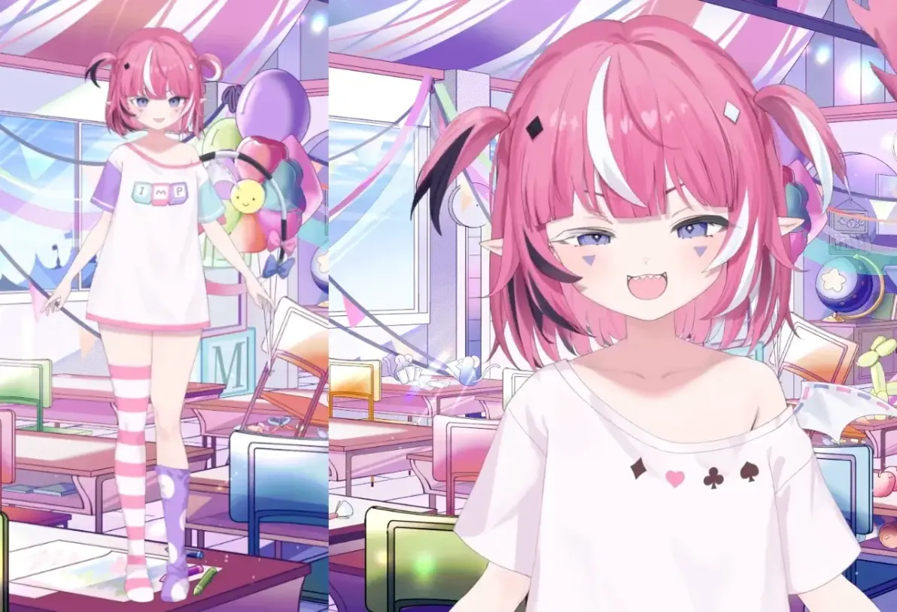

你的短发慵懒小恶魔已解锁！ 

- 上衣：宽松白色T恤，宽领口单肩垂落，尽显“我住在这里”的慵懒感。胸前三块粉彩色块拼出“I M P”（ ~~I AM PEE~~ ）。左袖紫色，右袖浅蓝；衣摆饰有细粉色条纹。
- 腿/脚部：左大腿袜至大腿中部饰有粉白横条纹，右大腿袜为紫底白点，刻意错配却又精妙的精品恶魔高级品味。
- 整体氛围：俏皮舒适的撞色混乱美学，依然透着十足的Camimi气质。

<iframe src="//www.bilibili.com/blackboard/html5mobileplayer.html?bvid=BV1sQxvzREWw&page=1&as_wide=1" allowfullscreen="allowfullscreen"></iframe>

【熟肉】Camila的新衣展示！ BV1sQxvzREWw   
Caimla新衣的演示视频 

## 传记

### 起源

> *“在这一天，整整一千年前，一名年轻的少女自人群中走出。 她以好奇的目光环视四周，却并不知晓自己身在何处，亦不明白自己是谁。 尽管她尚未理解自身存在的目的，但有一点她确信无疑......”——旁白* *Vore*

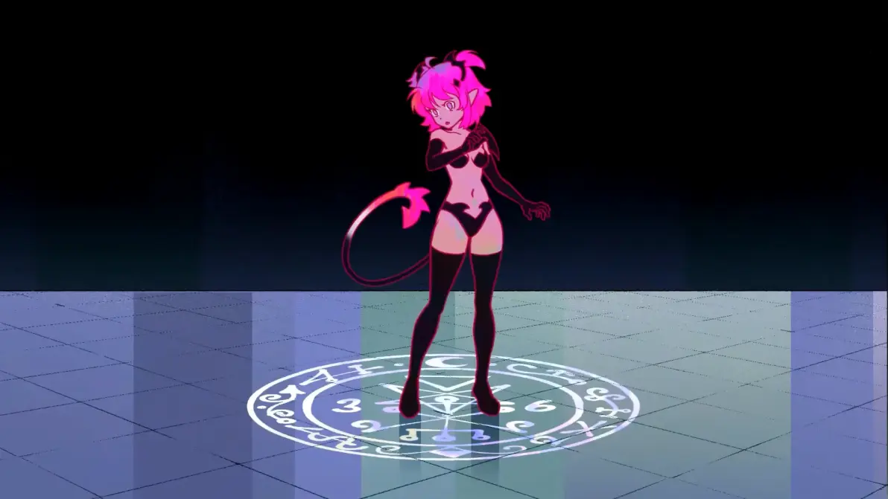

​	小恶魔生于魅魔之境，成长于魅魔群中。但其大半生遭人排斥的她，终日以捉弄魅魔为乐。

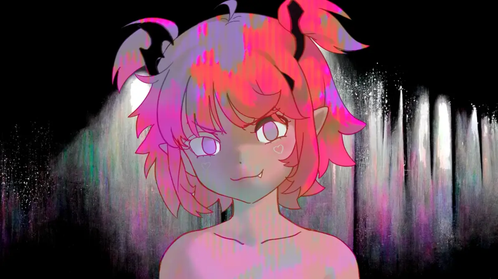

​	某日，她偶然闯入境中盛会，自然趁机潜入，施展拿手好戏。当她混迹于魅魔队列之中时，被一名疑似精英的魅魔识破，被斥为“*残次品* ”并下令处决。

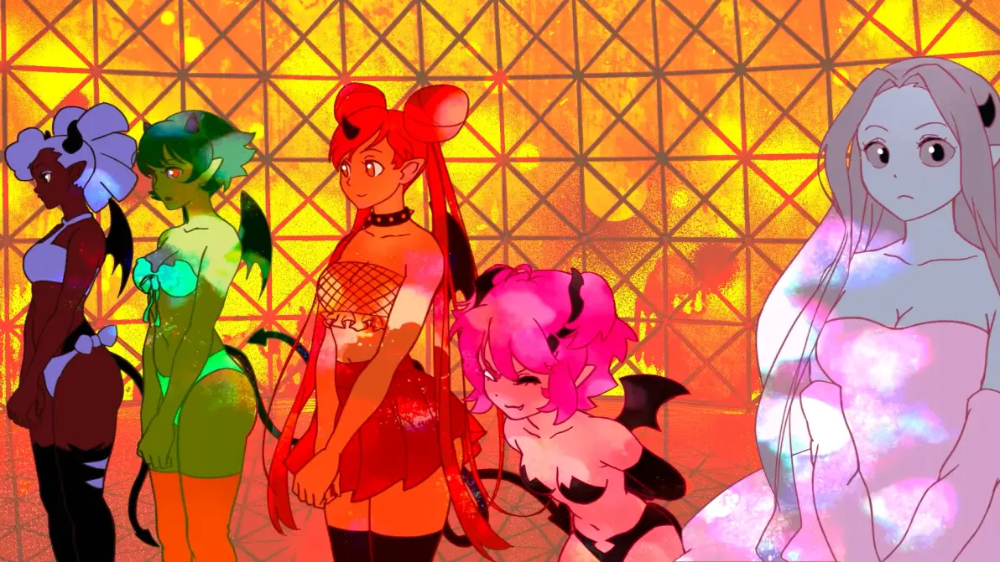

​	小恶魔用以荒诞之物挡下梦魔的致命一击，遂得以脱身。逃亡途中，意外发现了通往“地球 ”的传送门装置。

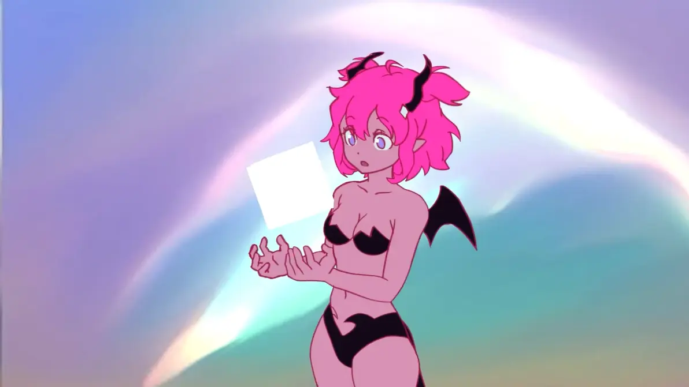

​	正是在这里，她找到了人生新目标与崭新的自我。 

### 第一只皮皮

​	被传送到名为“*地球* ”的新世界后，小恶魔四处游荡，发现这个新天地更美好，更自由。她终于拥有归属。

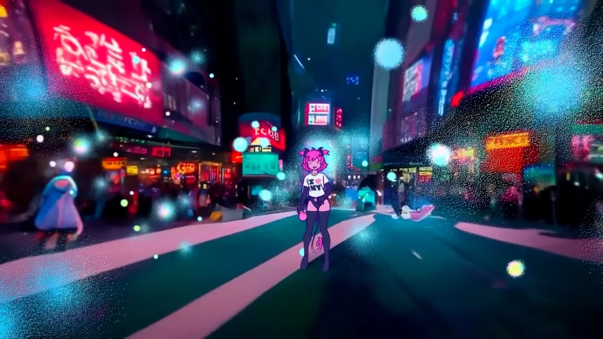

​	探索新世界整整一天后，她她在城郊洞穴中发现一只奄奄一息的生灵，里面栖息着一只来自“*地球 ”*的小生物——**猫**。

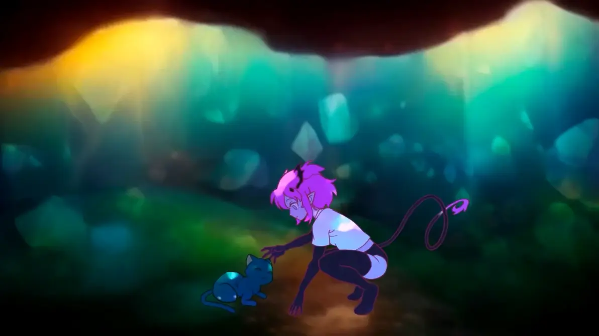

​	这只猫营养不良，濒临死亡。小恶魔心生怜悯，施展恶魔之力相助，然其力量并未止步于复生，副作用将猫转化成了小猫妖，于是第一只皮皮就此诞生。

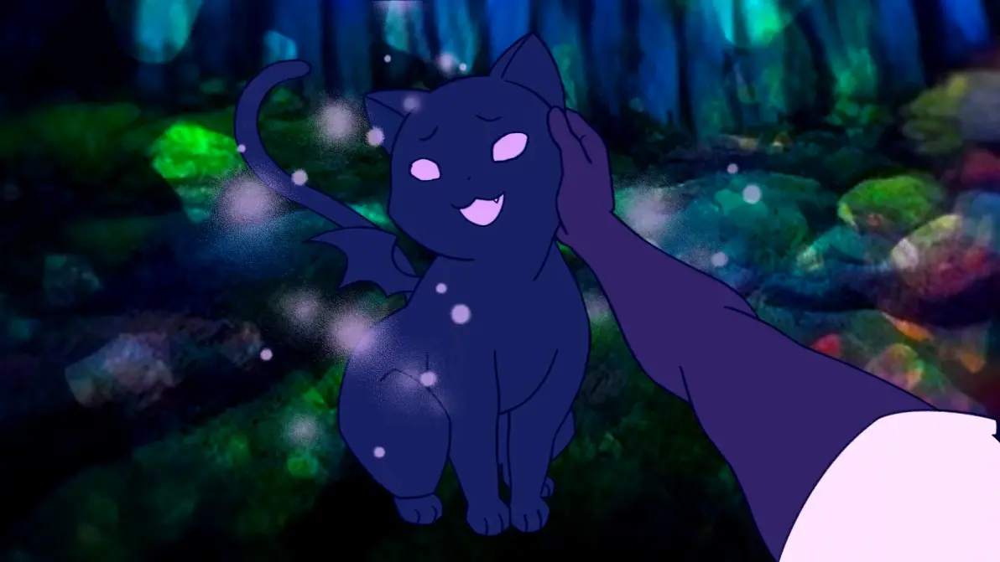

​	此乃第一位皮皮，亦是小恶魔最初的同行者，最亲密的伙伴。 

### 马戏团时期

​	在适应这个新世界后，小恶魔为自己取名Camila。她成功找到了新家，与皮皮们组建了家庭，并开始融入新世界。

​	尽管取得诸多成就，但因获取这些生活必需品所付出的艰辛，重创了小恶魔的精神。

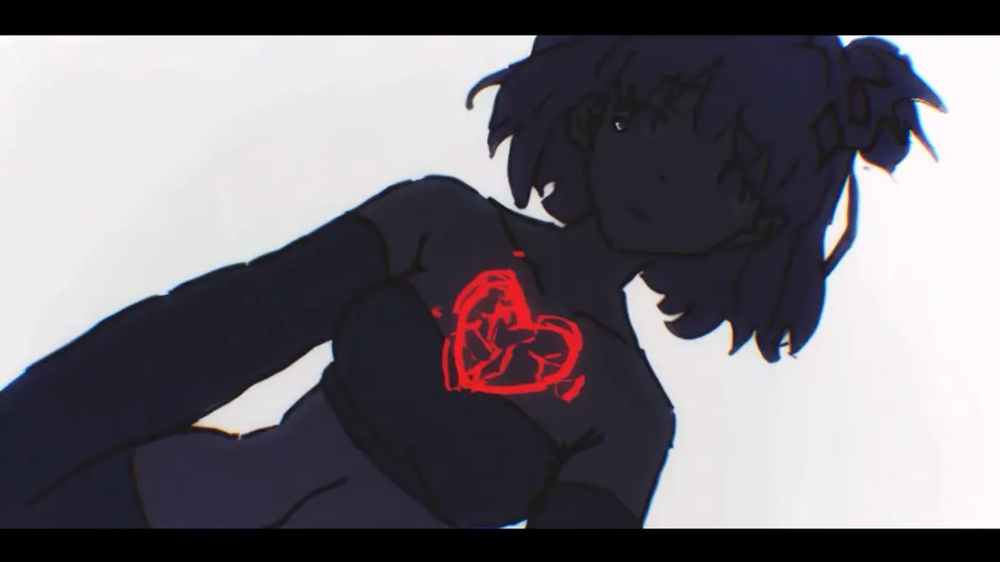

​	她在新世界屡遭拒绝，再次与当地人群格格不入，始终无法获得稳定工作，在感情生活中更屡遭欺瞒与利用，这些经历彻底**侵蚀**了她。~~（ 好难过，求好心人打赏5赠阅 ）~~

​	于是...劳碌不息终癫疯。

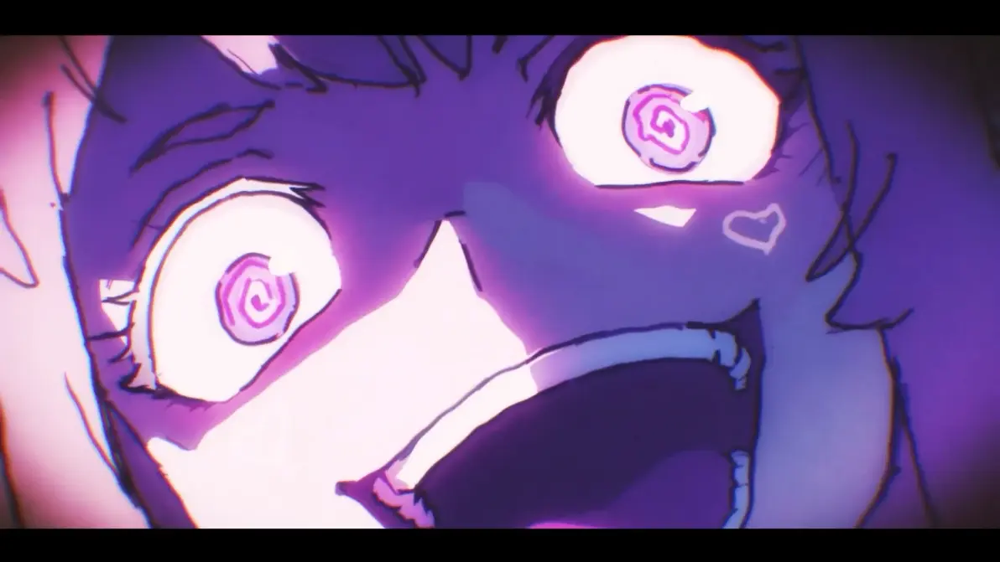

​	察觉异样的皮皮们竭力用惊喜安慰她，却徒劳无功。小恶魔屡次回避，将其关切拒之门外。

​	皮皮们愈发忧心，小恶魔却再度犹豫着推开他们。

​	某日，她独自深入林中。

​	森林里升起一枚飘浮的气球，好奇心驱使她追随其后，穿行良久，最终气球将她引向写着“马戏团”的大门前，她**鼓起勇气**穿过大门，一座奇特的巨型帐篷正在那里等着她。

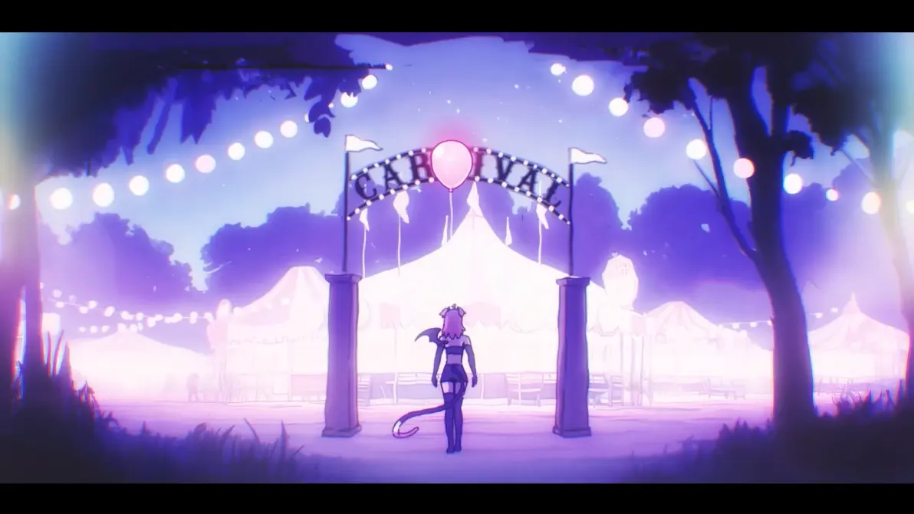

​	步入帐篷，灯火初暗，她的皮皮们迎了上来，终于能向小恶魔展示他们精心策划的惊喜。

​	随后，**灯光骤亮**，其余皮皮从藏身处一拥而上，为小恶魔披上一套全新的装束。

​	小恶魔因此拥抱了皮皮们（那会可还没签契约呢）。

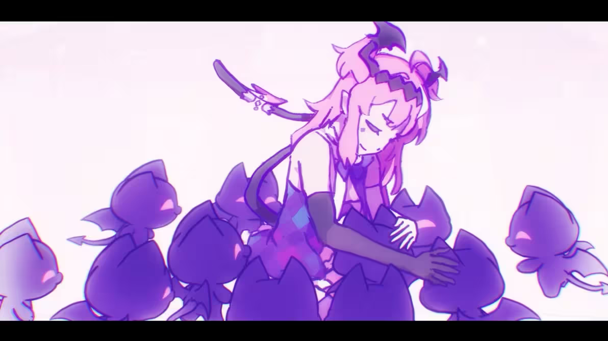

​	皮皮们为她准备了一套全新的装束，亦为她准备了她与皮皮们一同栖息，表演的马戏团，这让小恶魔绽放出最灿烂的笑容。

​	由此，小恶魔找到存在于世的**全新意义**，马戏团遂成其居所，亦成其舞台，她选择以小丑之姿，与皮皮们一同嬉戏喧哗，使孤独之人得以片刻忘却自身的重量。

<iframe src="//www.bilibili.com/blackboard/html5mobileplayer.html?bvid=BV14x4y1178k&page=1&as_wide=1" allowfullscreen="allowfullscreen"></iframe>

【中文字幕】Camila 起源故事【Camila】【VTuber】 BV14x4y1178k   
背景故事视频由[Mukkiw](https://x.com/m_ukkiw)制作

## 外观设定

### Camila Ver2.0

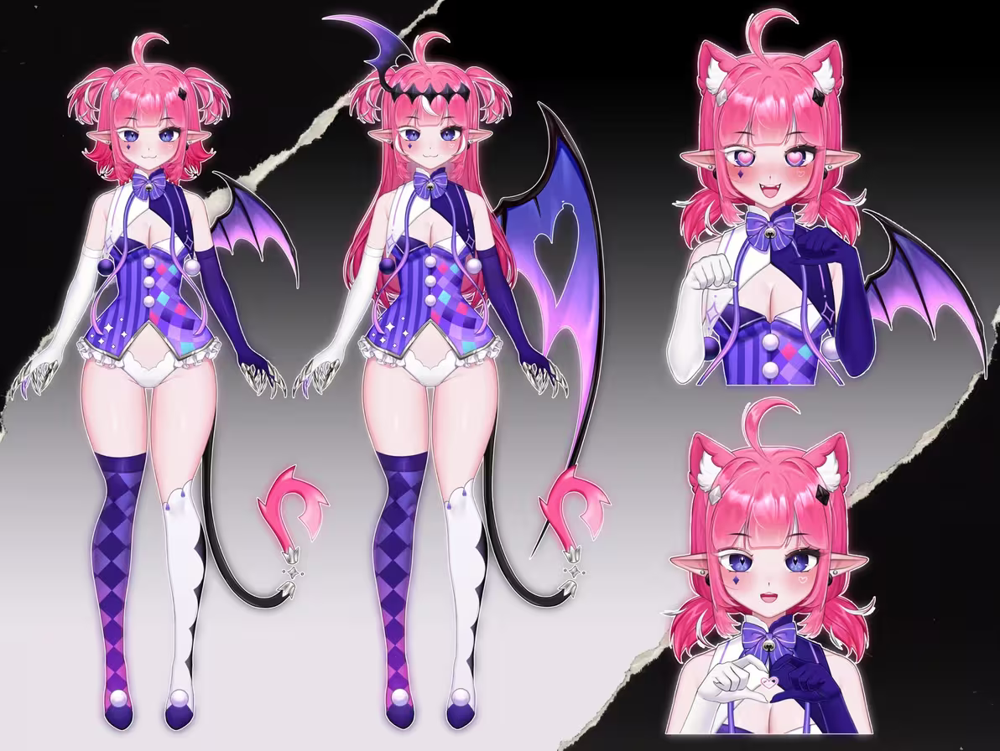

Camila Ver2.0早期设定图 

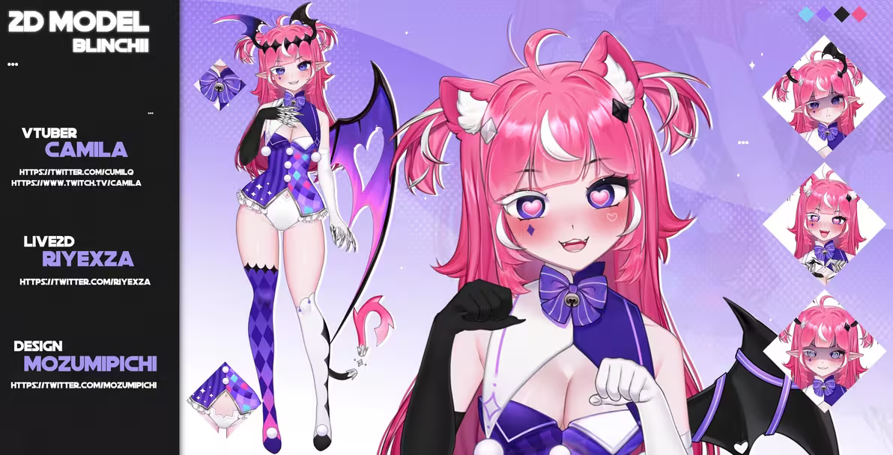

Camila Ver2.0 设定图（添加了一些颜色以及细节上的优化 ~~增加了尿布形态~~ ） 

- 头发与犄角：鲜艳的多层粉色发型，梳着齐刘海，头顶两只向外弯曲的黑色蝙蝠翅膀状犄角，更添小精灵般的恶魔气质。
- 眼睛与耳朵：深紫色眼睛，瞳孔呈菱形。耳朵形似精灵耳，修长而尖锐。
- 服饰：上身穿紫蓝相间的菱形丑角图案紧身胸衣，饰有白色荷叶边与星形纹样。紧身衣下是纯白内衬连体衣。*~~（尿布）~~*
- 配饰：颈间系着紫色领结，其上悬挂着小铃铛。
- 手套：双臂均佩戴长手套，一侧为黑色，另一侧为白色，手套末端为尖锐的爪状指尖。*（但是在变成猫猫手时会收回爪子，**豪猫** ）*
- 翅膀：背生单翼，翼面垂挂紫色布条。
- 腿饰：不对称的袜子，一条腿套着饰有紫色渐变菱形纹的过膝长袜，另一条腿则穿着带黑色镶边的纯白长袜。
- 尾巴：修长纤细的尾巴梢点缀上一抹粉色，为整体造型上下呼应。

### Camila Ver3.0

Camila Ver3.0全身图 

- 整体风格：日式动漫风2D造型，略带可爱特质的袖珍恶魔，粉彩哥特洛丽塔`pastel-goth Lolita`与现代小丑`jester`美学的碰撞。
- 配色方案：长春花蓝、柔粉、偏紫藏青色为主色系。黑白色荷叶边/纽扣点缀提亮；缎带与鞋履间微量黑色点缀。
- 头部与发型：中长粉发，刘海间点缀一片白色挑染。扎双马尾，右侧以黑色缎带束缚。小恶魔耳+歪戴派对帽（蝴蝶结+绒球+黑白荷叶边）。
- 面部与表情：淡紫渐变大眼，眼中闪烁星光，小小鲨鱼牙若隐若现，两眼下饰有长春花蓝+柔粉倒三角妆造。
- 服饰：白色拉夫领。偏紫藏青色短款泡泡袖夹克，内搭缎带纽扣白背心。长春花蓝色喇叭裙饰粉色爱心与白色菱形花纹，内衬荷叶边裙摆确保旋转时飞扬飘逸。
- 手臂与双手：白色宽袖口，点缀双排粉蓝纽扣。双手自然垂放，手指微张仿佛要偷你薯条……喵嘿嘿。
- 腿部：混搭大腿袜：
  - 左：粗粉+长春花蓝条纹配双白绒球。
  - 右：偏紫藏青色配粉色细条纹，束有荷叶边带。
- 鞋履：双色玛丽珍，左脚白色 右脚黑色，双鞋鞋头系蝴蝶结。*（随时准备狠狠踢你屁股）*
- 尾巴：黑白条纹恶魔尾巴。鞋头系两只迷你蝴蝶结（粉+蓝），类似Ver2.0版尾巴设计，但末端饰有毛茸茸的粉色尾尖。*（随时挠你痒痒~）*

## 趣闻

- 她的粉丝被称为**Cimps**（皮皮们）。这是猫咪被小恶魔复活后的产物*（没错，我们就是那只猫）*。
- 她的姓氏是**Inpu** *（千真万确）*。
- 她**喜欢：**寿司、蜜桃冰茶、肢体接触（黏人的小恶魔）、恐怖片与爱情片，以及音乐会。
- 她**讨厌：毒品**、飞虫*（深有同感）*、乡村音乐、**熊孩子**（很有道理）、长袖衬衫、雷声和脚。
- 爱好包括：电子游戏（用“玩”有点夸张）*、*数字艺术、唱歌、角色扮演、烹饪烘焙和健身*（小恶魔需要练练肌肉）*。
- 她拥有**黎巴嫩**血统。
- Camila选择的这个名字源于对**卡米拉·卡贝洛**的狂热喜爱。她最爱的卡贝洛歌曲是《In The Dark》，该曲也启发了她某段背景音乐的创作。

## 昵称

- camel（卡骆骆*~~（骆驼）~~*）

- **camimi**（卡咪咪）
- camoomoo （卡沫沫）
- cumliq（绞尽脑汁想出来的推特ID）
- camz（卡姆兹）
- cam（卡姆）（卡式相机）
- camimeat（卡米肉）
- mim （米因）（迷因）
- **mimi** （咪咪）

## 社媒账号

- [X(Twitter)](https://x.com/cumilq)
- [Twitch频道](https://www.twitch.tv/camila)
- [Discord频道](https://discord.com/invite/camila)
- [YouTube视频频道](https://www.youtube.com/channel/UCdjLJvro7Q3V0M2V2pwWfZA)
- [YouTube录播频道](https://www.youtube.com/@camilavods/featured)
- [YouTube切片频道](https://www.youtube.com/@camilaclips7)
- [TikTok视频账号](https://www.tiktok.com/@cumilq)
- [Reddit论坛](https://www.reddit.com/r/theimpire/)

## 社媒标签

- \#CAMILART - 同人/二创标签（仅限X）
- \#CUMILART - NSFW标签（已弃用）

---

小恶魔还有更多惊喜要呈现给你...嘻嘻嘻 

 
 
 
 

## 贡献者

  
  翻译:  [\_Veronique\_](https://space.bilibili.com/24850713) 
   

  
  校对/编辑:  [上村结川-Slanter](https://space.bilibili.com/15197245) 
   

  
  原Wiki页面： https://impire.live/about/camila
   

  
  网页开发/MD编辑:  [ClassIsBand](https://xn--fjqu59cvx0aoqi.icu/about/) 
   

**转载及翻译已均获授权，未经许可不得二次转载**